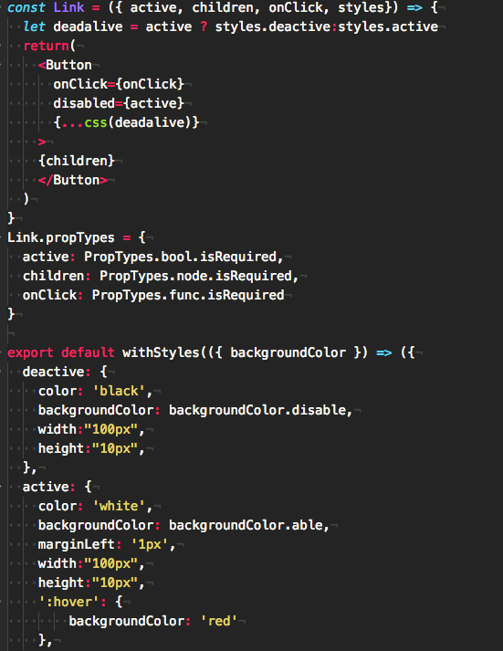
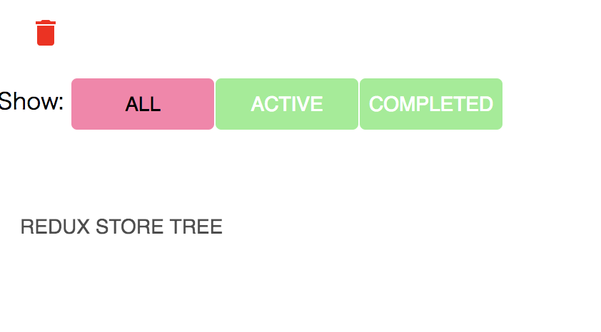
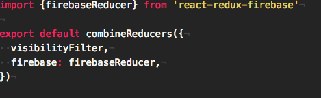
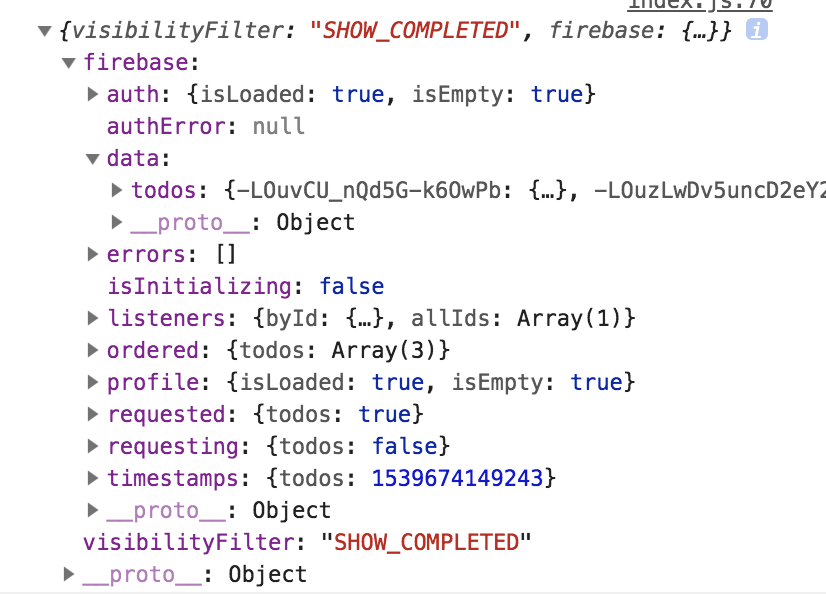
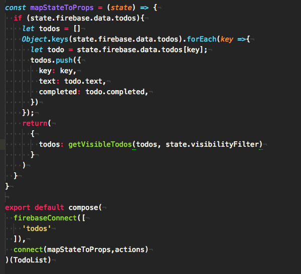
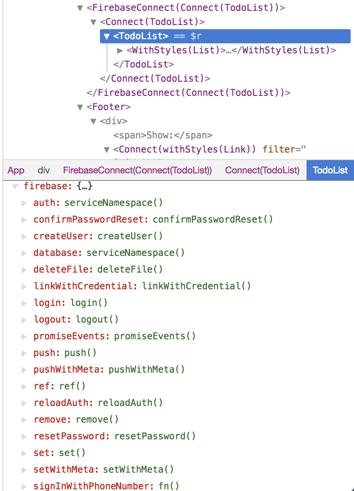
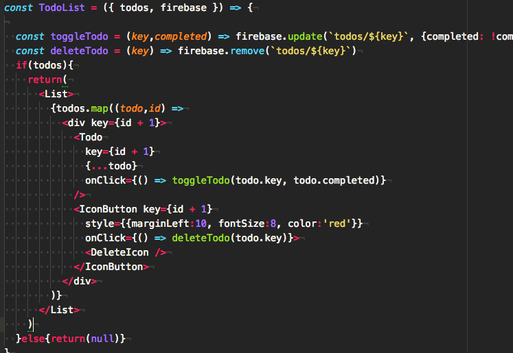

# Redux official + react-redux-firebase + react-with-styles

## 技術Stack遷移  

[Redux Basics](https://redux.js.org/basics)  
↓  
[Firebase API + Redux](https://qiita.com/gonta616/items/278a7e81a8b624d9621e)  
+[react-with-styles](https://github.com/airbnb/react-with-styles)  
↓  
__イマココ__  
[react-redux-firebase(rrf)](http://react-redux-firebase.com/)  
+
react-with-styles  


## [react-with-styles](https://github.com/airbnb/react-with-styles)  

### ReactでHover, anime(style)が使える(as aphrodite interface)
  
  

withStyles, cssをImportしてきて、ComponentのExportと一緒にCombine, Style適用させたいタグの中にStyleオブジェクトを引数に与えたcssを展開する形で指定。


__よく使う色、その他スタイルのAliasを作れる。__  
- MyTheme.js  

```javascript
export default {
  backgroundColor: {
    hover: '#F44336',
    able: 'lightGreen',
    disable: '#FF80AB',
  },
};

```  

- withStyles.js  

```javascript
import ThemedStyleSheet from 'react-with-styles/lib/ThemedStyleSheet';
import aphroditeInterface from 'react-with-styles-interface-aphrodite';
import { css, withStyles } from 'react-with-styles';

import MyTheme from './MyTheme';

ThemedStyleSheet.registerTheme(MyTheme);
ThemedStyleSheet.registerInterface(aphroditeInterface);

export { css, withStyles, ThemedStyleSheet };


```  
のように、Styleオブジェクトを指定してwithStylesのデフォルト引数に入れられる。withStylesでExportするときに同じ名前の引数を設定する。  


## [react-redux-firebase(rrf)](http://react-redux-firebase.com/)  

### ReducerにFirebase Reducerを追加する。
ReduxのStoreのステート、state.firebase.data.以下にRealtime DatabaseのTreeがJavascript Object形式で追加される

  
  


Stateに収納されたデータをComponentで使いたい時は、firebaseConnectでTreeの親Keyを指定(↓の場合todos)、mapStateToProps(↓はJSobject→list)で形を整えてComponentと一緒にExport

  


firebaseConnect、withFirebase(Methodだけ使いたい場合)でComponentをExportした場合は、そのComponentに、DB操作、Auth操作のMethodが詰まったfirebaseオブジェクトがPropsとして渡される(↓はChrome react dev tool)  

  


各コンポーネントでFirebaseAPIと同じDB操作のMethodを使ってRealtimeに引数を更新してRenderできる  


  
